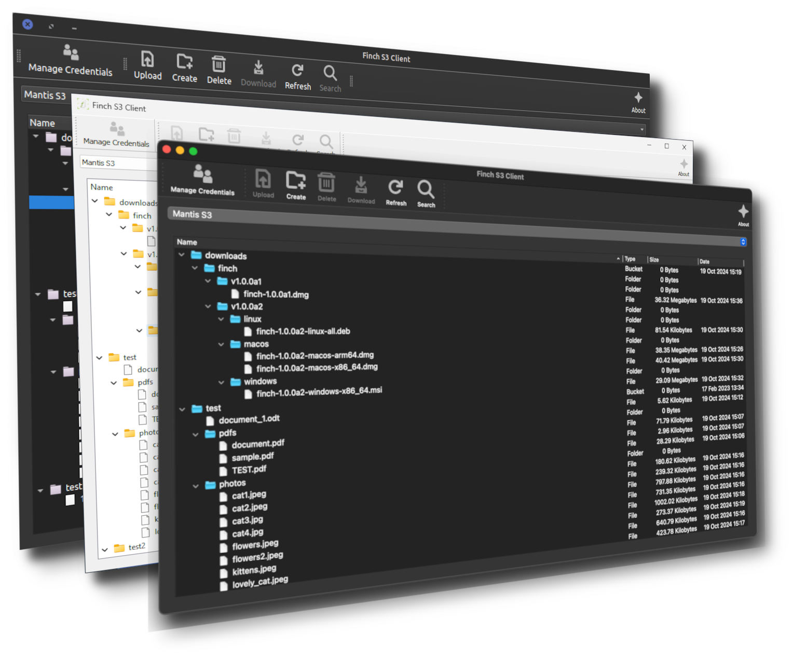

# Finch S3 Client

Open source and cross-platform GUI client for Amazon S3 and compatible storage platforms.

## Features

- Support for multiple credential through access & secret keys
- Use cross-platform secure secret key storage
- Browse and manage your S3 buckets and objects in file tree
- Delete folders and buckets recursively
- Upload and download files
- More features, soon

## Installation

**Warning:** This software is currently in alpha stage, this means you can experience bugs and crashes any time. 
Don't use alpha, beta and RC (Release Candidate) versions for production environments. 
This version tested in this platforms:
- Ubuntu 18.04 on Intel proccessor
- Mac OS Monterey on M1 processor
- Mac OS Ventura on M1 processor

To install Finch S3 Client, follow these steps:

To install S3 Client, follow these steps:

1. Download the latest release for your platform from the releases page. 
2. Install the downloaded executable according to your platform's instructions.
 
Alternatively, you can create your own executable with pyinstaller.

## Contributing

Finch S3 Client is an open source project, and we welcome contributions from the community. If you would like to contribute, please follow these steps:

1. Fork the repository and clone it to your local machine.
2. Make your changes and submit a pull request.
3. A maintainer will review your pull request and work with you to merge it if it is accepted.

## License
Finch S3 Client is released under the [MIT License](https://github.com/mantis-software-company/finch/blob/main/LICENSE).

Icons used in GUI was copied from GNOME [Adwaita](https://gitlab.gnome.org/GNOME/adwaita-icon-theme) icon theme. 

## Credits
S3 Client was created by [Furkan Kalkan](https://github.com/geekdinazor).

We also want to give credit to the following open source libraries used in this project:

- [boto3](https://pypi.org/project/boto3/)
- [pyqt5](https://pypi.org/project/PyQt5/)
- [keyring](https://pypi.org/project/keyring/)
- [python-slugify](https://pypi.org/project/python-slugify/)